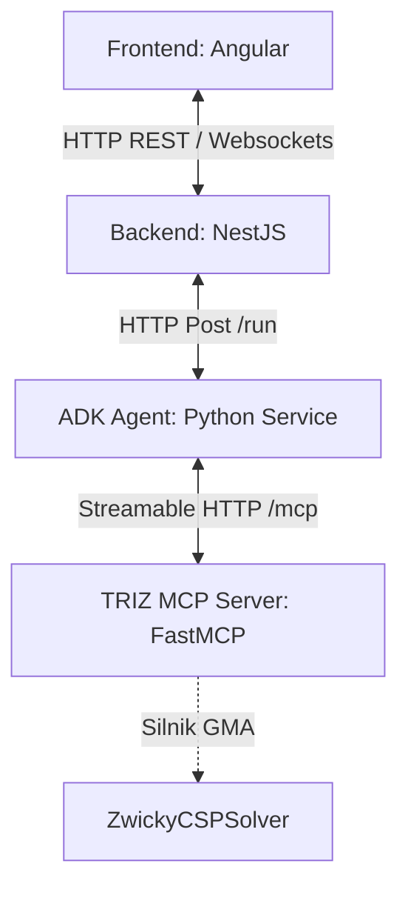

# Specyfikacja Techniczna: Integracja GMA MCP (General Morphological Analysis)

> **Cel dokumentu:** Niniejszy plik stanowi zaktualizowaną, bezpieczną i kompletną specyfikację wejściową (Technical Specification) do wdrożenia modułu analizy morfologicznej (GMA) w architekturze projektu **4D-ProblemSolver**. Dokument koryguje nieścisłości architektoniczne poprzednich wersji, dostosowuje integrację do rzeczywistej struktury repozytorium (NestJS, ADK Agent, TRIZ MCP Server) oraz wprowadza mechanizmy walidacji danych i ochrony przed przepełnieniem pamięci (safeguards).

---

## 1. Architektura Systemu i Przepływ Danych (Integration Flow)

W odróżnieniu od uproszczonych założeń, serwer GMA MCP nie jest osobnym mikroserwisem, lecz **nowym modułem narzędziowym (tool)** wbudowanym w istniejący serwer narzędziowy **TRIZ MCP Server** (napisanym w Pythonie przy użyciu `FastMCP`).

Aktualny przepływ danych w systemie wygląda następująco:



### Szczegółowy przebieg procesu:
1. **NestJS** (`app.service.ts`) odbiera zapytanie od użytkownika i przesyła je jako payload `/run` do **ADK Agent** (port `8081`).
2. Główny koordynator **ADK Agent** (`root_agent`) deleguje zadanie do agenta specjalistycznego `alternative_solver` (zdefiniowanego w `gma_solver.py`).
3. Agent `alternative_solver` wywołuje narzędzie `analyze_morphology` zarejestrowane na serwerze **TRIZ MCP Server** (port `8000/mcp`), przesyłając ustrukturyzowane listy wymiarów oraz reguł CCA.
4. **TRIZ MCP Server** uruchamia wbudowany, deterministyczny algorytm przeszukiwania z nawrotami (`ZwickyCSPSolver`) w czasie rzeczywistym.
5. Silnik odrzuca konfiguracje niespójne na podstawie macierzy CCA (Cross-Consistency Assessment) i zwraca listę poprawnych kandydatów architektur/produktów.
6. Agent `alternative_solver` na podstawie tych kandydatów generuje 3 ustrukturyzowane rekomendacje inżynieryjne, które przekazuje z powrotem przez `root_agent` do NestJS w celu wizualizacji i oceny MCDA.

---

## 2. Istotne Poprawki Spójności w Repo (ADK Agent Bugfix)

> [!IMPORTANT]
> W obecnej strukturze katalogu `application/backend/adk-agents/problem_solver/` występuje krytyczny błąd importu uniemożliwiający uruchomienie aplikacji:
> - Plik definiujący agenta `alternative_solver` został błędnie nazwany `gma_solver.py` (zamiast `alternative_solver.py`), podczas gdy główny plik `agent.py` próbuje go zaimportować poleceniem:
>   `from problem_solver.alternative_solver import alternative_solver`
> 
> **Krok naprawczy:**
> Należy albo zmienić nazwę pliku `gma_solver.py` na `alternative_solver.py`, albo zaktualizować import w `agent.py` na:
> `from problem_solver.gma_solver import alternative_solver`
> Wdrożenie GMA MCP powinno również odpowiednio zmodyfikować instrukcję systemową (instruction) dla agenta `alternative_solver` w tym pliku, tak by agent wiedział o istnieniu i sposobie użycia narzędzia `analyze_morphology`.

---

## 3. Kontrakty Danych (Pydantic Models)

Aby FastMCP automatycznie wygenerował poprawny schemat JSON dla wywołania narzędzia LLM, definicja parametrów musi być silnie typowana. Do celów walidacji i przesyłania danych definiujemy następujące modele w Pythonie:

```python
from pydantic import BaseModel, Field

class Dimension(BaseModel):
    name: str = Field(
        ..., 
        description="Nazwa parametru lub wymiaru strukturalnego w Zwicky Box (np. 'Material')"
    )
    variants: list[str] = Field(
        ..., 
        description="Lista dopuszczalnych wariantów/wartości dla danego wymiaru"
    )

class Incompatibility(BaseModel):
    dim1: str = Field(..., description="Nazwa pierwszego wymiaru w regule wykluczenia")
    var1: str = Field(..., description="Wartość wariantu dla pierwszego wymiaru")
    dim2: str = Field(..., description="Nazwa drugiego wymiaru w regule wykluczenia")
    var2: str = Field(..., description="Wartość wariantu dla drugiego wymiaru")
```

---

## 4. Silnik Logiczny: `ZwickyCSPSolver` (Robust Backtracking Engine)

W celu zapewnienia niezawodności i ochrony przed awariami (np. przepełnienie pamięci przy zbyt dużych skrzynkach Zwicky'ego lub pętla przy złych danych), silnik solwera musi realizować walidację poprawności oraz wprowadzać limity bezpieczeństwa.

```python
class ZwickyCSPSolver:
    def __init__(
        self,
        dimensions: list[Dimension],
        incompatibilities: list[Incompatibility],
        max_candidates: int = 1000
    ):
        self.dimensions = dimensions
        self.incompatibilities = incompatibilities
        self.max_candidates = max_candidates
        
        # Słowniki pomocnicze dla optymalizacji O(1)
        self.dim_variants = {d.name: set(d.variants) for d in dimensions}
        self.forbidden_pairs = set()

    def validate(self) -> list[str]:
        """Wykonuje rygorystyczną walidację wejścia. Zwraca listę komunikatów o błędach."""
        errors = []
        
        if not self.dimensions:
            errors.append("Lista wymiarów (dimensions) nie może być pusta.")
            return errors

        # 1. Walidacja unikalności wymiarów i wariantów
        seen_dims = set()
        for d in self.dimensions:
            stripped_name = d.name.strip()
            if not stripped_name:
                errors.append("Nazwa wymiaru nie może być pusta.")
            if stripped_name in seen_dims:
                errors.append(f"Zdublowany wymiar w definicji: '{stripped_name}'.")
            seen_dims.add(stripped_name)
            
            if not d.variants:
                errors.append(f"Wymiar '{d.name}' musi zawierać przynajmniej jeden wariant.")
            else:
                seen_vars = set()
                for v in d.variants:
                    stripped_var = v.strip()
                    if not stripped_var:
                        errors.append(f"Wymiar '{d.name}' zawiera pusty wariant.")
                    if stripped_var in seen_vars:
                        errors.append(f"Wymiar '{d.name}' zawiera zdublowany wariant: '{stripped_var}'.")
                    seen_vars.add(stripped_var)

        # 2. Walidacja spójności macierzy CCA (incompatibilities) z wymiarami
        for idx, inc in enumerate(self.incompatibilities):
            # Sprawdzenie wymiaru i wariantu 1
            if inc.dim1 not in self.dim_variants:
                errors.append(f"Reguła CCA #{idx+1}: Wymiar '{inc.dim1}' nie istnieje w definicji skrzynki.")
            elif inc.var1 not in self.dim_variants[inc.dim1]:
                errors.append(f"Reguła CCA #{idx+1}: Wariant '{inc.var1}' nie istnieje w wymiarze '{inc.dim1}'.")
                
            # Sprawdzenie wymiaru i wariantu 2
            if inc.dim2 not in self.dim_variants:
                errors.append(f"Reguła CCA #{idx+1}: Wymiar '{inc.dim2}' nie istnieje w definicji skrzynki.")
            elif inc.var2 not in self.dim_variants[inc.dim2]:
                errors.append(f"Reguła CCA #{idx+1}: Wariant '{inc.var2}' nie istnieje w wymiarze '{inc.dim2}'.")

        return errors

    def solve(self) -> dict:
        """Uruchamia przeszukiwanie z nawrotami (Backtracking CSP)."""
        errors = self.validate()
        if errors:
            return {
                "status": "error",
                "message": "Błąd walidacji parametrów wejściowych.",
                "errors": errors,
                "candidates": []
            }
            
        # Generowanie symetrycznego zbioru zabronionych par dla O(1)
        for inc in self.incompatibilities:
            self.forbidden_pairs.add((inc.dim1, inc.var1, inc.dim2, inc.var2))
            self.forbidden_pairs.add((inc.dim2, inc.var2, inc.dim1, inc.var1))
            
        solutions = []
        limit_exceeded = False
        
        def backtrack(dim_idx: int, current_assignment: dict[str, str]):
            nonlocal limit_exceeded
            if len(solutions) >= self.max_candidates:
                limit_exceeded = True
                return
                
            if dim_idx == len(self.dimensions):
                solutions.append(current_assignment.copy())
                return
                
            current_dim = self.dimensions[dim_idx]
            for variant in current_dim.variants:
                if is_consistent(current_dim.name, variant, current_assignment):
                    current_assignment[current_dim.name] = variant
                    backtrack(dim_idx + 1, current_assignment)
                    del current_assignment[current_dim.name]

        def is_consistent(dim_name: str, variant: str, assignment: dict[str, str]) -> bool:
            for assigned_dim, assigned_var in assignment.items():
                if (dim_name, variant, assigned_dim, assigned_var) in self.forbidden_pairs:
                    return False
            return True

        # Rozpoczęcie algorytmu
        backtrack(0, {})
        
        response = {
            "status": "success",
            "count": len(solutions),
            "candidates": solutions
        }
        
        if limit_exceeded:
            response["warning"] = (
                f"Przekroczono limit bezpieczeństwa kombinacji ({self.max_candidates}). "
                f"Zwrócono pierwsze {self.max_candidates} wyników."
            )
            
        return response
```

---

## 5. Rejestracja Narzędzia w FastMCP (Idiomatic Integration)

Zamiast przekazywać surowy ciąg znaków JSON i parsować go ręcznie, wykorzystujemy pełny potencjał biblioteki FastMCP do automatycznego wygenerowania schematu wejściowego.

Lokalizacja pliku: `application/backend/triz-mcp-server/app/tools/gma.py`

```python
from mcp.server.fastmcp import FastMCP
from app.tools.gma_models import Dimension, Incompatibility # Zakładając podział na moduły
# Lub bezpośrednie definicje modeli w pliku

def register_gma_tool(mcp: FastMCP) -> None:
    @mcp.tool()
    def analyze_morphology(
        dimensions: list[Dimension],
        incompatibilities: list[Incompatibility]
    ) -> dict:
        """
        Wykonuje Ogólną Analizę Morfologiczną (GMA) jako solver CSP przy użyciu macierzy CCA.
        Filtruje technologicznie lub logicznie sprzeczne konfiguracje wariantów produktu.
        
        Args:
            dimensions: Pełna lista wymiarów (parametrów) oraz ich dozwolonych wariantów.
            incompatibilities: Lista par wariantów, które nie mogą ze sobą współwystępować (CCA).
        """
        solver = ZwickyCSPSolver(dimensions, incompatibilities)
        return solver.solve()
```

Rejestracja narzędzia w `application/backend/triz-mcp-server/app/tools/__init__.py`:

```python
from app.tools.gma import analyze_morphology

tools = [
    # Istniejące narzędzia TRIZ...
    analyze_morphology,
]
```

---

## 6. Przypadek Testowy (Verification Scenario)

Standardowy scenariusz weryfikacji działania oparty na opakowaniach ekologicznych (SDG 12):

### Wejście (Parametry wywołania narzędzia przez Agent):
```json
{
  "dimensions": [
    {
      "name": "Material",
      "variants": ["Mono-Coir (kokos)", "Sloma", "Karton"]
    },
    {
      "name": "Bariera ochronna",
      "variants": ["Nanoceluloza", "Wosk pszczeli", "Brak"]
    },
    {
      "name": "Ergonomia transportu",
      "variants": ["Wprasowane przetloczenia chwytowe", "Sznurek klejony"]
    }
  ],
  "incompatibilities": [
    {
      "dim1": "Material", "var1": "Karton",
      "dim2": "Bariera ochronna", "var2": "Brak"
    },
    {
      "dim1": "Material", "var1": "Sloma",
      "dim2": "Ergonomia transportu", "var2": "Wprasowane przetloczenia chwytowe"
    }
  ]
}
```

### Oczekiwany Wynik (Wyjście z Solvera):
Z 18 możliwych teoretycznych kombinacji (`3 * 3 * 2`) solver automatycznie odrzuci te sprzeczne z CCA (np. `Karton + Brak` oraz `Słoma + Wprasowane przetłoczenia`), zwracając listę poprawnych architektur produktowych:

```json
{
  "status": "success",
  "count": 12,
  "candidates": [
    {
      "Material": "Mono-Coir (kokos)",
      "Bariera ochronna": "Nanoceluloza",
      "Ergonomia transportu": "Wprasowane przetloczenia chwytowe"
    },
    {
      "Material": "Mono-Coir (kokos)",
      "Bariera ochronna": "Nanoceluloza",
      "Ergonomia transportu": "Sznurek klejony"
    },
    {
      "Material": "Mono-Coir (kokos)",
      "Bariera ochronna": "Wosk pszczeli",
      "Ergonomia transportu": "Wprasowane przetloczenia chwytowe"
    },
    {
      "Material": "Mono-Coir (kokos)",
      "Bariera ochronna": "Wosk pszczeli",
      "Ergonomia transportu": "Sznurek klejony"
    },
    {
      "Material": "Mono-Coir (kokos)",
      "Bariera ochronna": "Brak",
      "Ergonomia transportu": "Wprasowane przetloczenia chwytowe"
    },
    {
      "Material": "Mono-Coir (kokos)",
      "Bariera ochronna": "Brak",
      "Ergonomia transportu": "Sznurek klejony"
    },
    {
      "Material": "Sloma",
      "Bariera ochronna": "Nanoceluloza",
      "Ergonomia transportu": "Sznurek klejony"
    },
    {
      "Material": "Sloma",
      "Bariera ochronna": "Wosk pszczeli",
      "Ergonomia transportu": "Sznurek klejony"
    },
    {
      "Material": "Sloma",
      "Bariera ochronna": "Brak",
      "Ergonomia transportu": "Sznurek klejony"
    },
    {
      "Material": "Karton",
      "Bariera ochronna": "Nanoceluloza",
      "Ergonomia transportu": "Wprasowane przetloczenia chwytowe"
    },
    {
      "Material": "Karton",
      "Bariera ochronna": "Nanoceluloza",
      "Ergonomia transportu": "Sznurek klejony"
    },
    {
      "Material": "Karton",
      "Bariera ochronna": "Wosk pszczeli",
      "Ergonomia transportu": "Wprasowane przetloczenia chwytowe"
    },
    {
      "Material": "Karton",
      "Bariera ochronna": "Wosk pszczeli",
      "Ergonomia transportu": "Sznurek klejony"
    }
  ]
}
```

---

## 7. Instrukcja Krok po Kroku do Wdrożenia

### Krok 1: Dodanie Modułu GMA do `triz-mcp-server`
1. W katalogu `/application/backend/triz-mcp-server/app/tools/` utwórz plik `gma.py` i wklej do niego modele Pydantic, solwer oraz narzędzie FastMCP według sekcji 4 i 5.
2. Zarejestruj narzędzie w `/application/backend/triz-mcp-server/app/tools/__init__.py`.

### Krok 2: Naprawa Agenta ADK (problem_solver)
1. Zmień nazwę pliku `/application/backend/adk-agents/problem_solver/gma_solver.py` na `/application/backend/adk-agents/problem_solver/alternative_solver.py` (lub dostosuj import w `agent.py`).
2. Zaktualizuj opis i instrukcje systemowe agenta w `alternative_solver.py`, instruując go, by przed zaproponowaniem 3 rozwiązań alternatywnych dokonywał analizy morfologicznej za pomocą narzędzia `analyze_morphology` (jeśli napotka złożone problemy wieloparametrowe).

### Krok 3: Testy Lokalne
1. Uruchom serwer MCP lokalnie za pomocą `uv run python app/main.py` z katalogu `triz-mcp-server`.
2. Przetestuj działanie narzędzia przy użyciu MCP Inspector:
   ```bash
   npx @modelcontextprotocol/inspector
   ```
   Podłącz się do `http://localhost:8000/mcp` i wywołaj `analyze_morphology` z payloadem testowym z sekcji 6.

