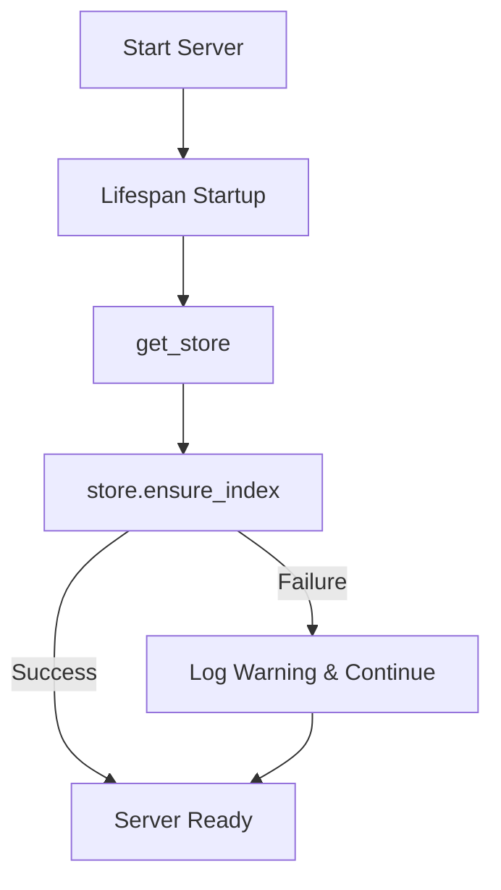

# 🚀 The Ultimate MCP & TRIZ Server Guide: From Zero to Hero

This document explains everything about the Model Context Protocol (MCP), how our custom TRIZ server works, how to configure it, integrate it with LM Studio, and how to debug any issues you encounter.

---

## 📖 Table of Contents
1. **What is MCP (Model Context Protocol)?**
2. **What is TRIZ and the Contradiction Matrix?**
3. **The Architecture of our Python MCP Server**
4. **Configuration Secrets (`.env` & `config.py`)**
5. **Integrating with LM Studio**
6. **Troubleshooting Checklist (When things break)**

---

## 1. What is MCP (Model Context Protocol)?

At its simplest: **MCP is a standardized "USB port" for AI models.**

Historically, if you wanted an LLM (like Claude or Gemini) to use a tool (like search a database, read a file, or query an API), you had to write custom, ad-hoc integrations for every single model and client. 

With **MCP**:
* **The Server** exposes tools, resources, and prompts over a standard protocol (JSON-RPC).
* **The Client** (like LM Studio, Cursor, Claude Desktop, or the MCP Inspector) connects to the server and automatically discovers all the tools the server has.

### Transports: How Client and Server Talk
MCP supports two main connection types:
1. **Stdio (Standard Input/Output):** The client spawns the server as a child process and reads/writes to it directly. Good for local desktop apps.
2. **SSE / Streamable HTTP:** The server runs as a web server (typically on a port like `8123`) and the client connects over HTTP. This is what we are using.

---

## 2. What is TRIZ and the Contradiction Matrix?

**TRIZ** (a Russian acronym for "Theory of Inventive Problem Solving") is a systematic methodology for solving engineering problems.

### Core Concepts:
1. **Engineering Parameters (1–39):** Standard physical properties of any system (e.g., `#1 Weight of moving object`, `#14 Strength`, `#21 Temperature`).
2. **Inventive Principles (1–40):** Standard design heuristics used to solve conflicts (e.g., `#1 Segmentation`, `#8 Counterweight`, `#35 Parameter Changes`).
3. **The Contradiction Matrix:** A 39x39 grid where:
   * **Rows** represent the parameter you want to **improve**.
   * **Columns** represent the parameter that is **getting worse (preserving)**.
   * The intersection of the row and column gives you the **Inventive Principles** historically used to solve that specific conflict without compromising.

---

## 3. The Architecture of our Python MCP Server

The server uses the **FastMCP** SDK, which simplifies building MCP servers in Python.

### The Lifecycle (`app/main.py`)


1. **Lifespan Context:** Before the server handles requests, the `lifespan` function starts up. It calls `store.ensure_index()`.
2. **Semantic Search / Embeddings:** To search parameters and principles by natural language (e.g. searching "weight" instead of ID `1`), the server uses a vector index (`ensure_index()`). 
3. **Resiliency Patch:** We added a `try...except` wrapper around `store.ensure_index()`. If your local embedding model fails or is offline, the server logs a warning but **does not crash**, allowing the direct tools to continue working.

---

## 4. Configuration Secrets (`.env` & `config.py`)

Pydantic Settings loads configuration from your environment and `.env` files. There are three critical things to know:

### 1. The Directory Trap (Cwd)
In `config.py`, the configuration searches for `.env` files relative to the **Current Working Directory** of the running terminal:
```python
env_file=(".env", "../.env")
```
* If you run `uv run python app/main.py` from `mcp-server/`, it loads `mcp-server/.env`.
* If you run it from the root directory `hackaton/` (common in IDE run configs), it loads `hackaton/.env`.
* **Fix:** We updated both `.env` files to be synchronized so that whichever one is loaded, it behaves identically.

### 2. The `env_ignore_empty` Flag
By default, in many boilerplate setups, `env_ignore_empty=True` is enabled.
* **The Problem:** If you set `EMBEDDING_MODEL=""` in `.env` to disable embeddings, Pydantic sees it is empty, ignores it, and falls back to the default `"embeddinggemma:300m"`.
* **Fix:** We changed `env_ignore_empty=False` in `config.py` so that setting an empty string successfully overrides the defaults and disables the model.

---

## 5. Integrating with LM Studio

LM Studio can act as an MCP Client.

### 1. The `mcp.json` File
To configure LM Studio to talk to your server, add it to your `mcp.json` file (located in `C:\Users\sitko\.lmstudio\mcp.json`):
```json
{
  "mcpServers": {
    "triz-mcp-server": {
      "url": "http://localhost:8123/mcp"
    }
  }
}
```

### 2. Text Generation vs. Text Embedding Models
* **Gemma (e.g. `google/gemma-2-2b`)** is a Text Generation model. It cannot generate vector embeddings in LM Studio's `/v1/embeddings` API out-of-the-box.
* **Nomic Embed (e.g. `nomic-embed-text-v1.5`)** is a dedicated Text Embedding model. If you want to use local embeddings, you must download and load this model in LM Studio.

---

## 6. Troubleshooting Checklist

| Symptom | Cause | Solution |
| :--- | :--- | :--- |
| **`ECONNREFUSED` on port 8123** | The Python server is not running or crashed. | Check your python console logs and run `uv run python app/main.py` again. |
| **`ValueError: No embedding data received`** | The active model in LM Studio does not support embeddings. | Load a dedicated embedding model (like `nomic-embed-text`) in LM Studio, or change `EMBEDDING_MODEL=""` in your `.env` to disable it. |
| **`BadRequestError: No models loaded`** | No model is active in LM Studio. | Click the dropdown in the top header of LM Studio and select/load a model. |
| **`ZodError` / JSON validation error** | Connecting the inspector to LM Studio's port (`1234`) instead of MCP server (`8123`). | Ensure the inspector URL points to `http://localhost:8123/mcp`. |
